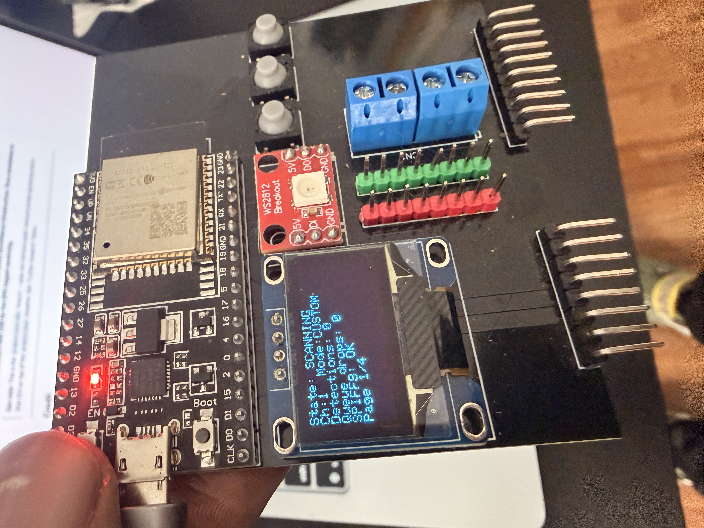
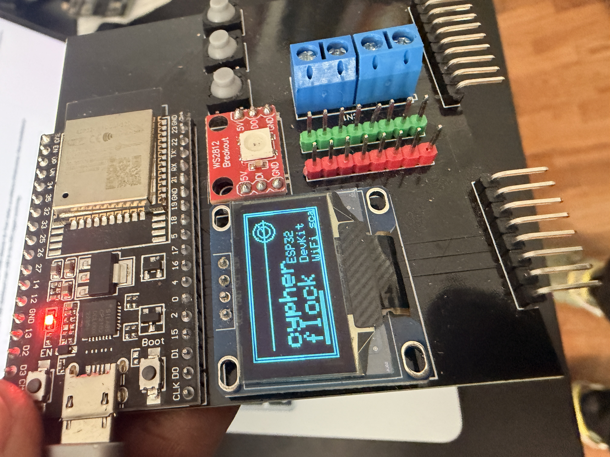
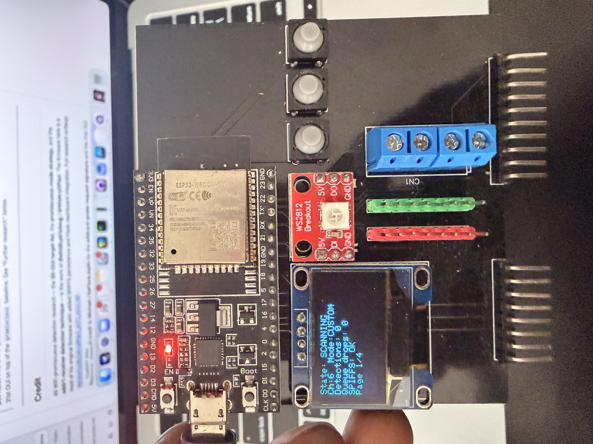

# Cypher Flock



Cypher Flock is a compact Arduino-based ESP32 WiFi detector for passive 2.4 GHz monitoring, built around a small OLED screen, three buttons, and a simple on-device workflow. It runs fully standalone on the board, and it can also stream detections over USB for a live dashboard on a computer.

This repo is now maintained as **Cypher Flock**.

## Gallery

| Hardware | Screen | UI |
|---|---|---|
|  |  |  |

## What It Does

- Passively listens on 2.4 GHz WiFi
- Checks frames for known target OUIs and related signatures
- Saves detections locally in SPIFFS
- Emits one JSON line per hit over USB serial
- Shows live status on the SSD1306 display
- Uses three buttons for navigation and control
- Scans BLE advertisements for Flock/Raven signatures with confidence scoring
- Serves an onboard AP file browser for logs and session files

The v2 firmware is a single compile-time-profiled Arduino sketch:

- [FlockYou.ino](FlockYou.ino)

## Supported Boards

| Profile | Target Board | Notes |
|---|---|---|
| `ESP32_S3` | ESP32-S3 DevKit | Uses the S3 wiring, active-low LED, mirror serial on GPIO43, LittleFS-only by default |
| `ESP32_DEVKIT` | ESP32 DevKit | Uses the normal ESP32 DevKit wiring, no button pullups on GPIO 34/36/39 |
| `ESP32_CYPHERBOX` | Cypherbox board | Uses the Cypherbox display, buttons, SD, GPS, and RFID pin map |

## Hardware

### ESP32 DevKit wiring

| Part | Pin |
|---|---|
| SSD1306 SDA | GPIO 5 |
| SSD1306 SCL | GPIO 4 |
| Button Up | GPIO 34 |
| Button Down | GPIO 36 |
| Button Select | GPIO 39 |
| LED | GPIO 27 |
| Buzzer | Optional |

### ESP32-S3 wiring

The ESP32-S3 profile uses its own board-friendly defaults in [src/profiles/ESP32_S3.h](src/profiles/ESP32_S3.h).

### Cypherbox wiring

The Cypherbox profile uses [src/profiles/Cypherbox.h](src/profiles/Cypherbox.h).

| Part | Pin |
|---|---|
| OLED SDA | GPIO 21 |
| OLED SCL | GPIO 22 |
| LED | GPIO 26 |
| Button Up | GPIO 34 |
| Button Down | GPIO 35 |
| Button Select | GPIO 15 |
| Button Home | GPIO 2 |
| SD CS | GPIO 5 |
| SD MOSI | GPIO 23 |
| SD MISO | GPIO 19 |
| SD SCK | GPIO 18 |
| GPS TX | GPIO 17 |
| GPS RX | GPIO 16 |
| RFID RST | GPIO 25 |
| RFID SS | GPIO 27 |

## Button Behavior

- `Up` changes pages or increases the current menu value
- `Down` changes pages or decreases the current menu value
- `Select` opens and steps through the menu
- Long press on `Select` toggles stealth mode: display and buzzer off while scanning continues

## Display

The OLED uses a 128x64 SSD1306 panel over I2C.

The firmware has 7 screens: scanner status, stats, last capture, live feed, GPS, activity chart, and proximity/confidence.

## Build

This project is Arduino-only. Use Arduino IDE or `arduino-cli`.

### Arduino CLI

For the ESP32 DevKit sketch:

```bash
arduino-cli core install esp32:esp32
arduino-cli lib install "Adafruit SSD1306" "Adafruit GFX Library" "U8g2_for_Adafruit_GFX" "NimBLE-Arduino" "TinyGPSPlus"
arduino-cli compile --fqbn esp32:esp32:esp32:PartitionScheme=huge_app \
  --build-property "build.extra_flags=-DESP32 -DBOARD_PROFILE=ESP32_DEVKIT" .
arduino-cli upload --fqbn esp32:esp32:esp32:PartitionScheme=huge_app \
  --build-property "build.extra_flags=-DESP32 -DBOARD_PROFILE=ESP32_DEVKIT" \
  -p /dev/cu.usbserial-0001 .
```

For the ESP32-S3 sketch:

```bash
arduino-cli compile --fqbn esp32:esp32:esp32s3:PartitionScheme=huge_app \
  --build-property "build.extra_flags=-DESP32 -DBOARD_PROFILE=ESP32_S3" .
arduino-cli upload --fqbn esp32:esp32:esp32s3:PartitionScheme=huge_app \
  --build-property "build.extra_flags=-DESP32 -DBOARD_PROFILE=ESP32_S3" \
  -p /dev/cu.usbserial-0001 .
```

For the Cypherbox board:

```bash
arduino-cli compile --fqbn esp32:esp32:esp32:PartitionScheme=no_ota \
  --build-property "build.extra_flags=-DESP32 -DBOARD_PROFILE=ESP32_CYPHERBOX" .
arduino-cli upload --fqbn esp32:esp32:esp32:PartitionScheme=no_ota \
  --build-property "build.extra_flags=-DESP32 -DBOARD_PROFILE=ESP32_CYPHERBOX" \
  -p /dev/cu.usbserial-0001 .
```

The root `partitions.csv` is a 4 MB-safe no-OTA layout with a 2 MB app slot and LittleFS storage. That keeps Cypherbox flashable on its original 4 MB ESP32 while still giving the v2 firmware enough room for WiFi, NimBLE, WebServer, LittleFS, and OLED support.

## Onboard Web UI

The board starts an AP named `CypherFlock` with password `flockpass`.

Open `http://192.168.4.1` for the file browser, `/files` for JSON, `/status` for device status, and `/reset` to clear session counters.

## Serial Output

Each detection emits a single JSON object over USB serial. That keeps the board easy to pair with a host app or a terminal monitor.

Example:

```json
{"event":"detection","detection_method":"wifi_oui_addr2","protocol":"wifi_2_4ghz","mac_address":"aa:bb:cc:dd:ee:ff","oui":"aa:bb:cc","device_name":"","rssi":-62,"channel":6,"frequency":2437,"ssid":"","confidence":50,"confidence_label":"MEDIUM"}
```

## Files

| Path | Purpose |
|---|---|
| `FlockYou.ino` | Unified firmware entrypoint |
| `flock-you.ino` | Arduino CLI compatibility wrapper for the root sketch folder |
| `src/` | Firmware modules and board profiles |
| `api/flockyou.py` | Host-side Flask dashboard and serial ingester |
| `datasets/` | Research notes and target lists |
| `img/` | Project images |

## Acknowledgments

Cypher Flock builds on the open research and field work of others in the WiFi detection space. The target-list and signature work in this repo is credited in the code and datasets where it originated.

## License

If you want, I can add a real license file next. For now this repo is documented as a personal project fork under the Cypher Flock name.
