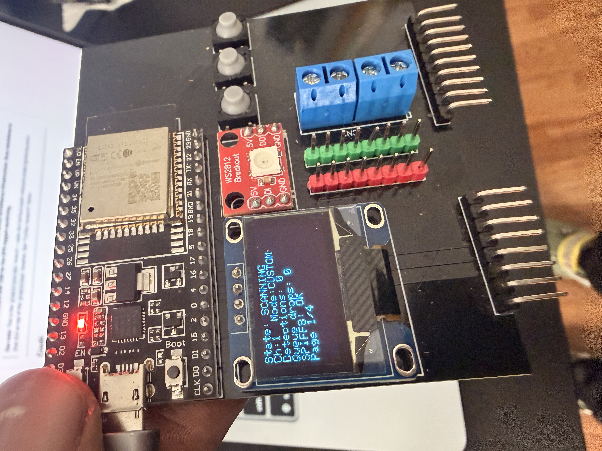
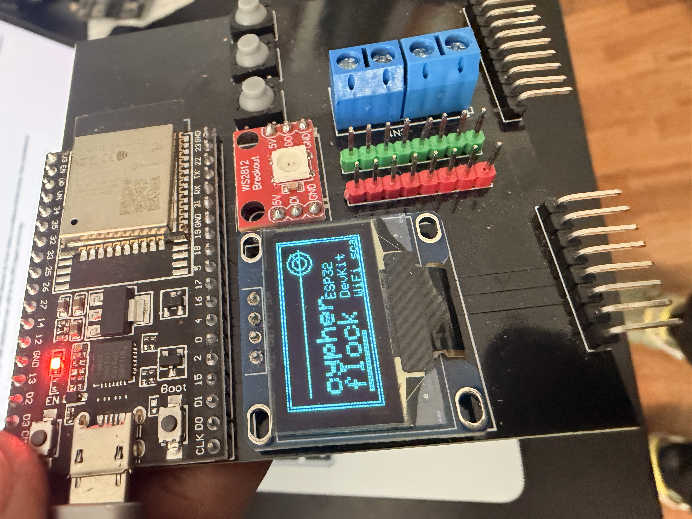
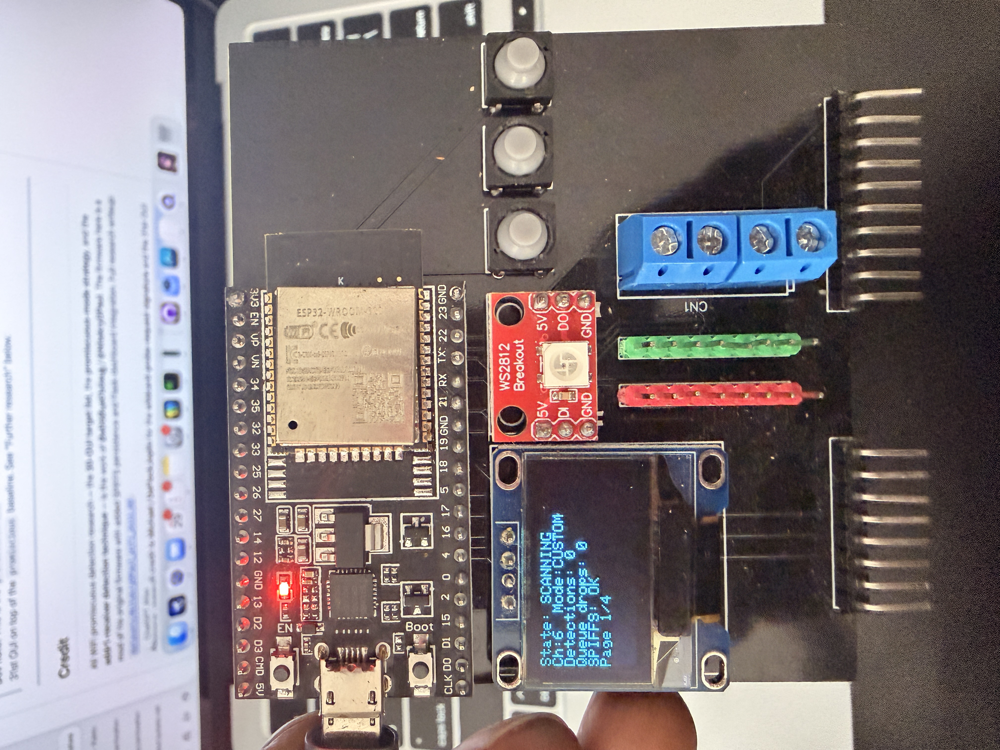

# Cypher Flock



Cypher Flock is a compact Arduino-based ESP32 WiFi detector for passive 2.4 GHz monitoring, built around a small OLED screen, three buttons, and a simple on-device workflow. It runs fully standalone on the board, and it can also stream detections over USB for a live dashboard on a computer.

This repo is now maintained as **Cypher Flock**.

## Gallery

| Hardware | Screen | UI |
|---|---|---|
|  |  |  |

## What It Does

- Passively listens on 2.4 GHz WiFi
- Checks frames for known target OUIs and related signatures
- Saves detections locally in SPIFFS
- Emits one JSON line per hit over USB serial
- Shows live status on the SSD1306 display
- Supports a color/touch Waveshare AMOLED profile with battery status
- Uses three buttons for navigation and control
- Scans BLE advertisements for Flock/Raven signatures with confidence scoring
- Serves an onboard AP file browser for logs and session files

The v2 firmware is a single compile-time-profiled Arduino sketch:

- [flock-you.ino](flock-you.ino)

## Supported Boards

| Profile | Target Board | Notes |
|---|---|---|
| `ESP32_S3` | ESP32-S3 DevKit | Uses the S3 wiring, active-low LED, mirror serial on GPIO43, LittleFS-only by default |
| `ESP32_DEVKIT` | ESP32 DevKit | Uses the normal ESP32 DevKit wiring, no button pullups on GPIO 34/36/39 |
| `ESP32_CYPHERBOX` | Cypherbox board | Uses the Cypherbox display, buttons, SD, GPS, and RFID pin map |
| `ESP32_WAVESHARE_AMOLED_18` | Waveshare ESP32-S3-Touch-AMOLED-1.8 | Uses SH8601 AMOLED, FT3168 touch, AXP2101 battery status, and 1-bit SD_MMC logging |

## Hardware

### ESP32 DevKit wiring

| Part | Pin |
|---|---|
| SSD1306 SDA | GPIO 5 |
| SSD1306 SCL | GPIO 4 |
| Button Up | GPIO 34 |
| Button Down | GPIO 36 |
| Button Select | GPIO 39 |
| LED | GPIO 27 |
| Buzzer | Optional |

### ESP32-S3 wiring

The ESP32-S3 profile uses its own board-friendly defaults in [src/profiles/ESP32_S3.h](src/profiles/ESP32_S3.h).

### Cypherbox wiring

The Cypherbox profile uses [src/profiles/Cypherbox.h](src/profiles/Cypherbox.h).

| Part | Pin |
|---|---|
| OLED SDA | GPIO 21 |
| OLED SCL | GPIO 22 |
| RGB LED / WS2812 data | GPIO 26 |
| Button Up | GPIO 34 |
| Button Down | GPIO 35 |
| Button Select | GPIO 15 |
| Button Home | GPIO 2 |
| SD CS | GPIO 5 |
| SD MOSI | GPIO 23 |
| SD MISO | GPIO 19 |
| SD SCK | GPIO 18 |
| GPS TX | GPIO 17 |
| GPS RX | GPIO 16 |
| RFID RST | GPIO 25 |
| RFID SS | GPIO 27 |

### Waveshare ESP32-S3 Touch AMOLED 1.8 wiring

The Waveshare AMOLED profile uses [src/profiles/Waveshare_AMOLED_18.h](src/profiles/Waveshare_AMOLED_18.h).

| Part | Pin |
|---|---|
| SH8601 QSPI SDIO0 | GPIO 4 |
| SH8601 QSPI SDIO1 | GPIO 5 |
| SH8601 QSPI SDIO2 | GPIO 6 |
| SH8601 QSPI SDIO3 | GPIO 7 |
| SH8601 QSPI SCLK | GPIO 11 |
| SH8601 QSPI CS | GPIO 12 |
| I2C SDA / FT3168 / AXP2101 | GPIO 15 |
| I2C SCL / FT3168 / AXP2101 | GPIO 14 |
| FT3168 touch interrupt | GPIO 21 |
| BOOT button | GPIO 0 |
| SD_MMC CLK | GPIO 2 |
| SD_MMC CMD | GPIO 1 |
| SD_MMC D0 | GPIO 3 |

## Button Behavior

- `Up` changes pages or increases the current menu value
- `Down` changes pages or decreases the current menu value
- `Select` opens and steps through the menu
- Long press on `Select` toggles stealth mode: display and buzzer off while scanning continues

## Display

The OLED uses a 128x64 SSD1306 panel over I2C.

The firmware has 7 screens: scanner status, stats, last capture, live feed, GPS/storage, activity chart, and proximity/confidence.

The Waveshare AMOLED profile renders the same detector screens on the 368x448 SH8601 display. Swipe left/right changes pages, swipe up/down scrolls or edits menu values where relevant, bottom taps jump to common pages, and touch hold toggles stealth mode. Its header shows AXP2101 battery/USB status when available.

On the Waveshare AMOLED profile, a short BOOT click cycles channel hopping mode (`FULL_HOP`, `CUSTOM`, `SINGLE`) and a long BOOT press toggles stealth mode. The `storage` serial command reports SD_MMC mount state, card type, size, and the last mount/write error when a card is not available.

## Build

This project is Arduino-only. Use Arduino IDE or `arduino-cli`.

### Arduino CLI

For the ESP32 DevKit sketch:

```bash
arduino-cli core install esp32:esp32
arduino-cli lib install "Adafruit SSD1306" "Adafruit GFX Library" "Adafruit NeoPixel" "U8g2_for_Adafruit_GFX" "NimBLE-Arduino" "TinyGPSPlus"
arduino-cli compile --fqbn esp32:esp32:esp32:PartitionScheme=huge_app \
  --build-property "build.extra_flags=-DESP32 -DBOARD_PROFILE=ESP32_DEVKIT" .
arduino-cli upload --fqbn esp32:esp32:esp32:PartitionScheme=huge_app \
  --build-property "build.extra_flags=-DESP32 -DBOARD_PROFILE=ESP32_DEVKIT" \
  -p /dev/cu.usbserial-0001 .
```

For the ESP32-S3 sketch:

```bash
arduino-cli compile --fqbn esp32:esp32:esp32s3:PartitionScheme=huge_app \
  --build-property "build.extra_flags=-DESP32 -DBOARD_PROFILE=ESP32_S3" .
arduino-cli upload --fqbn esp32:esp32:esp32s3:PartitionScheme=huge_app \
  --build-property "build.extra_flags=-DESP32 -DBOARD_PROFILE=ESP32_S3" \
  -p /dev/cu.usbserial-0001 .
```

For the Cypherbox board:

```bash
arduino-cli compile --fqbn esp32:esp32:esp32:PartitionScheme=no_ota \
  --build-property "build.extra_flags=-DESP32 -DBOARD_PROFILE=ESP32_CYPHERBOX" .
arduino-cli upload --fqbn esp32:esp32:esp32:PartitionScheme=no_ota \
  --build-property "build.extra_flags=-DESP32 -DBOARD_PROFILE=ESP32_CYPHERBOX" \
  -p /dev/cu.usbserial-0001 .
```

For the Waveshare ESP32-S3-Touch-AMOLED-1.8:

```bash
arduino-cli lib install "GFX Library for Arduino" "Arduino_DriveBus" "ESP32_IO_Expander" "XPowersLib"
FQBN='esp32:esp32:esp32s3:FlashSize=16M,PSRAM=opi,USBMode=default,CDCOnBoot=cdc,PartitionScheme=custom'
PORT='/dev/cu.usbmodemXXXX'
BUILD_DIR='/tmp/flock-build-waveshare-amoled'
arduino-cli compile --fqbn "$FQBN" --build-path "$BUILD_DIR" \
  --build-property "build.extra_flags=-DESP32 -DBOARD_PROFILE=ESP32_WAVESHARE_AMOLED_18" .
python3 - <<'PY'
import serial, time
port = '/dev/cu.usbmodemXXXX'
ser = serial.Serial(port, 1200)
ser.dtr = False
ser.rts = True
time.sleep(0.2)
ser.close()
PY
arduino-cli upload -p "$PORT" --fqbn "$FQBN" --input-dir "$BUILD_DIR" .
```

Waveshare's examples are designed for ESP32 Arduino core 3.x. Use the 16 MB flash, OPI PSRAM, USB-OTG/TinyUSB, CDC-on-boot, and local custom partition settings shown above. `arduino-cli upload` does not accept `--build-property`, so compile with the profile flag first and upload from the generated build directory.

The root `partitions.csv` is a 16 MB custom layout for the Waveshare AMOLED profile. Cypherbox keeps using the built-in `PartitionScheme=no_ota` command above so it does not receive the 16 MB partition table.

Cypherbox uses an onboard WS2812 RGB LED on GPIO 26. The firmware gives a soft green running pulse every 5 seconds and a red pulse when a detection is emitted.

## Onboard Web UI

The board starts an AP named `CypherFlock` with password `flockpass`.

Open `http://192.168.4.1` for the file browser, `/files` for JSON, `/status` for device status, and `/reset` to clear session counters.

## Serial Output

Each detection emits a single JSON object over USB serial. That keeps the board easy to pair with a host app or a terminal monitor.

Example:

```json
{"event":"detection","detection_method":"wifi_oui_addr2","protocol":"wifi_2_4ghz","mac_address":"aa:bb:cc:dd:ee:ff","oui":"aa:bb:cc","device_name":"","rssi":-62,"channel":6,"frequency":2437,"ssid":"","confidence":50,"confidence_label":"MEDIUM"}
```

## Serial Commands

All profiles also expose a shell-style command fallback over USB serial at `115200`. This is useful for a DevKit running without an OLED, a board with broken buttons, or a headless bench test.

```bash
arduino-cli monitor -p /dev/cu.usbserial-XXXX -c baudrate=115200
```

Core commands:

| Command | Purpose |
|---|---|
| `help` | Print the command reference |
| `status` | Show profile, scan state, heap, channel, detections, display, storage, GPS, and buzzer state |
| `page`, `page next`, `page prev`, `page 0-6` | Inspect or change the OLED page from serial |
| `menu` | Show channel mode, single-channel value, buzzer, stealth, and menu state |
| `mode full`, `mode custom`, `mode single` | Change channel hopping mode |
| `channel 1-13` | Switch to single-channel mode on a fixed channel |
| `scan pause`, `scan resume` | Pause or resume passive scanning |
| `buzzer on`, `buzzer off` | Toggle buzzer output where hardware is enabled |
| `stealth on`, `stealth off` | Toggle display/buzzer stealth mode |
| `gps` | Show GPS fix details, or report that GPS is not compiled for the profile |
| `storage` | Show LittleFS, SD, save, and detection storage state |
| `detections` | Show session counts and the last detection summary |
| `reset session` | Clear current in-memory detections and session counters |
| `save` | Force a LittleFS session save |
| `reboot` | Restart the board |

## Files

| Path | Purpose |
|---|---|
| `flock-you.ino` | Unified firmware entrypoint |
| `src/` | Firmware modules and board profiles |
| `api/flockyou.py` | Host-side Flask dashboard and serial ingester |
| `datasets/` | Research notes and target lists |
| `img/` | Project images |

## Acknowledgments

Cypher Flock builds on the open research and field work of others in the WiFi detection space. The target-list and signature work in this repo is credited in the code and datasets where it originated.
